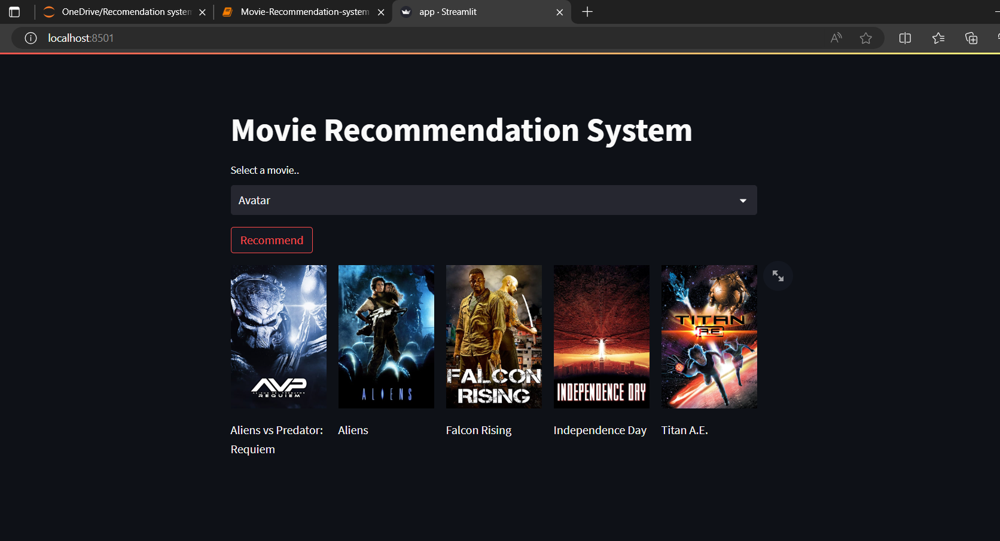
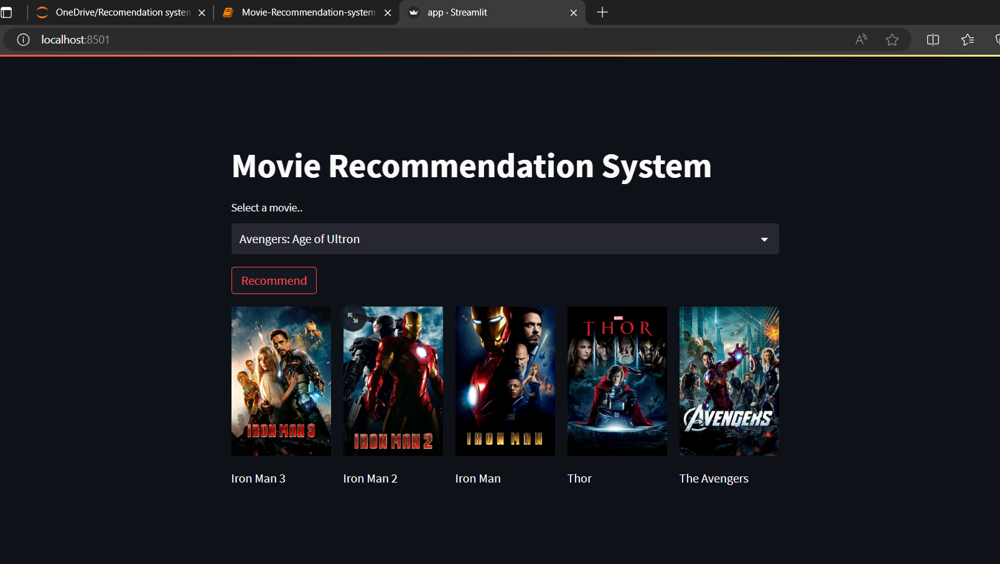
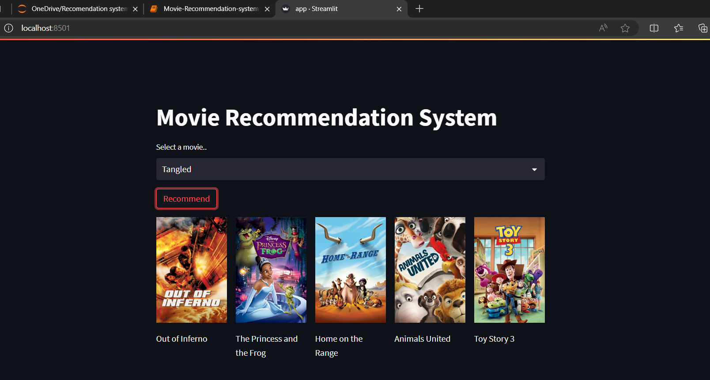

# Movie Recommendation System 📽️🔥

This project is a content-based movie recommendation system that suggests movies based on their similarity to a selected movie. The recommendation system is built using Python libraries such as Numpy, Pandas, NLTK, and Scikit-learn, and the frontend is created using Streamlit.

## Features

- Data cleaning and transformation using Numpy and Pandas.
- Stemming of words using NLTK.
- Text vectorization using the Bag of Words technique.
- Calculation of cosine similarity to find the most similar movies.
- Export of similarity vectors using Pickle for use in the frontend.
- Frontend built with Streamlit for an interactive user experience.
- Fetching movie posters from TMDB API.

## Project Structure

- `app.py`: Main file to run the Streamlit app.
- `movies_dict.pkl`: Pickled dictionary containing movie data.
- `similarity.pkl`: Pickled similarity matrix.
- `README.md`: Project documentation.
- `requirements.txt`: List of required libraries for the project.

## Installation

1. Clone the repository:
   ```bash
   git clone https://github.com/Heetika22/Movie-Recommendation-System.git
   cd Movie-Recommendation-System
   ```
2. Create a virtual environment and activate it:
   ```bash
   python -m venv myenv
   #Windows
   myenv\Scripts\activate
   #macOS/Linux
   source myenv/bin/activate
   ```
3. Install the required libraries:
   ```bash
   pip install -r requirements.txt
   ```
4. Set up Jupyter Notebook with the virtual environment:
   ```bash
   pip install ipykernel
   python -m ipykernel install --user --name=movie-recommender-env
   ```
5. Run Jupyter Notebook:
   ```bash
   jupyter notebook
   ```
6. Run the Streamlit app:
   ```bash
   streamlit run app.py
   ```






## How it Works

1. Data Cleaning and Transformation:

- Libraries such as Numpy and Pandas are used for data cleaning and transformation.
- Tags are created for each movie to aid in the recommendation process.
  
2. Text Processing:

- NLTK is used to perform stemming of words to normalize the text data.

3. Vectorization:

- The Bag of Words technique is used for text vectorization with CountVectorizer from Scikit-learn to find the most common words.
  
4. Similarity Calculation:

- Cosine similarity is used to calculate the distance or similarity between each movie with another.

5. Export Data:

- The similarity vectors and the final dataframe (consisting of movie_id, title, and tags) are exported using Pickle for use in the frontend.

6. Frontend:

- Built using Streamlit, the frontend allows users to select a movie and get recommendations along with posters fetched from the TMDB API.

## Dependencies

- Python 3.x
- Streamlit
- Numpy
- Pandas
- NLTK
- Scikit-learn
- Requests
- Pickle
- ipykernel

## API Key

Replace YOUR_API_KEY in the fetch_poster function with your TMDB API key. You can obtain an API key by creating an account on TMDB and generating an API key from your account settings.

## Contributing

Feel free to submit issues or pull requests if you have suggestions or improvements.
